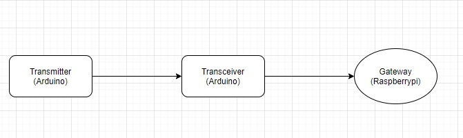
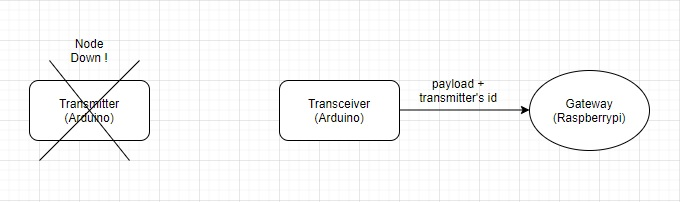
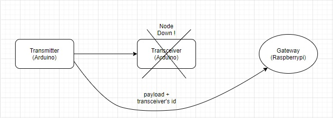

# Nrf24l01-Mesh-Network

## 1. Introduction
This project is about eveloping a wireless sensors network for fire detection in fields, nodes measure several factors (temperature, humidity ...) and forward them either to the next node or to the gateway.

## 2. Description
The wireless communication is established through the Nrf24l01 module which operates in the 2.4Ghz ISM band, if a node is down or off for unknown causes it's neighbor is capable of detecting that and will add some informations to it's payload to inform the gateway about the issue.

## 3. Wireless Sensors Network Architecture
The transmitter measure multiple factors and forward them to the transceiver, which will receive the data and will sent it with it's own sensed data to the gateway.

## 4. Transmitter Down Case
 If the transmitter is down for some reasons, the transceiver is capable of detecting that and it will inform the gateway about this issue by adding the transmitter's id to it's payload.
 
 

## 5. Transceiver Down Case
For each packet sent from the transmitter to the transceiver, an acknowledgement payload is exchanged to ensure that the transceiver is working properly, in case the transmitter don't receive  any ACK payload after certain tries, it will try to send it's data directly to the gateway and it will add the transceiver's id to it's payload to inform the gateway about the problem.
After reaching the gateway directly, the trasmitter will always try to establish a communication with the transceiver, if the issue is solved and it's back to work properly, we will automatically switch to our normal scenario (transmitter -> transceiver -> gateway)

